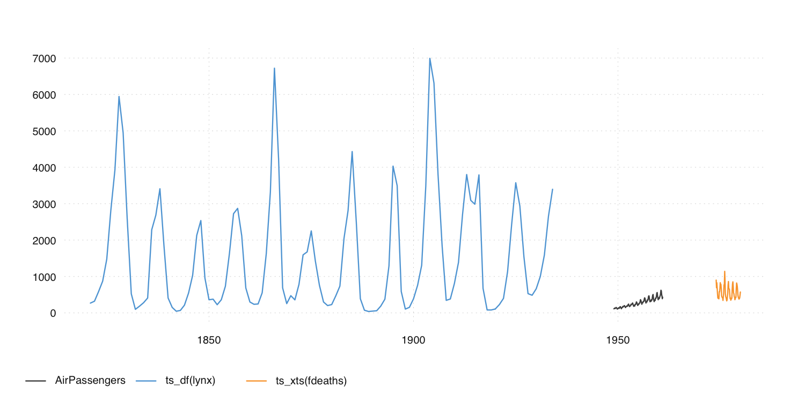

The R ecosystem knows a [vast
number](https://CRAN.R-project.org/view=TimeSeries)  of time series
standards. Instead of creating the ultimate [15th](https://xkcd.com/927/) time
series class, tsbox provides a set of tools that are **agnostic towards the
existing standards**. The tools also allow you to handle time series as plain
data frames, thus making it easy to deal with time series in a
[dplyr](https://CRAN.R-project.org/package=dplyr) or
[data.table](https://CRAN.R-project.org/package=data.table) workflow.

tsbox is built around a set of converters, which convert time series
stored as `ts`, `xts`, `zoo`, `zooreg`, `data.frame`, `data.table`, `tbl`,
`tbl_ts`, `tbl_time`, `tis`, `irts` or `timeSeries` to each other.
Because this works reliably, we can easily write
functions that work for all classes. So whether we want to smooth, scale,
differentiate, chain, forecast, regularize, or seasonally adjust a time series,
we can use the same commands to whatever time series class at hand. And, most
conveniently, we get a time series plot function that works for all classes and
frequencies.

To install the stable version from CRAN:
```r
install.packages("tsbox")
```

To install the development version:
```r
# install.packages("remotes")
remotes::install_github("ropensci/tsbox")
```

## Convert everything to everything

tsbox can convert time series stored as `ts`, `xts`, `zoo`, `zooreg`,
`data.frame`, `data.table`, `tbl`, `tbl_ts`, `tbl_time`, `tis`, `irts` or
`timeSeries` to each other:

```r
library(tsbox)
x.ts <- ts_c(fdeaths, mdeaths)
x.xts <- ts_xts(x.ts)
x.df <- ts_df(x.xts)
x.dt <- ts_dt(x.df)
x.tbl <- ts_tbl(x.dt)
x.zoo <- ts_zoo(x.tbl)
x.tsibble <- ts_tsibble(x.zoo)
x.tibbletime <- ts_tibbletime(x.tsibble)
x.timeSeries <- ts_timeSeries(x.tibbletime)
all.equal(ts_ts(x.timeSeries), x.ts)  # TRUE
```

## Use the same functions for all time series classes

tsbox provides a basic toolkit for handling time series. These functions start
with `ts_`, so you use them with auto-complete (press Tab). These functions work
with any *ts-boxable* time series, ts, xts, data.frame, data.table tibble, zoo, tsibble or timeSeries and **return the class of their inputs**.

For example, the `ts_scale` function performs *normalization* - it subtracts the
mean and divides by the standard deviation of series. Like almost all ts-
functions, it can be used on any ts-boxable object, with single or multiple
time series. Because `ts_scale` normalizes time series, it is useful to make
different time series comparable. All of the following operations perform the
same task, but return the same object class as the input:

```r
ts_scale(x.ts)
ts_scale(x.xts)
ts_scale(x.df)
ts_scale(x.dt)
ts_scale(x.tbl)
```

There is a bunch of other transformation functions: `ts_trend`, which estimates
a trend; functions to calculate differences, `ts_pc`, `ts_pcy`, `ts_diff`,
`ts_diffy`; a function to shift series, `ts_lag`; functions to construct
indices, both from levels and percentage change rates: `ts_index` and
`ts_compound`. For a full list of functions, check out the reference.


## Combine multiple time series

A set of helper functions makes it easy to combine multiple time series, even if
their classes are different. The basic workhorse is `ts_c`, which collects
time series. Again, this works with single or multiple series of any ts-boxable
class:

```r
ts_c(ts_dt(EuStockMarkets), AirPassengers)
ts_c(ts_tbl(mdeaths), EuStockMarkets, ts_xts(lynx))
```

If you want to choose a different name for single series, name the arguments:

```r
ts_c(ts_dt(EuStockMarkets), `Airline Passengers` = AirPassengers)
```

Multiple series can also be combined into a single series:

```r
ts_bind(ts_xts(mdeaths), AirPassengers)
```

`ts_chain` offers an alternative way to combine time series, by *chain-linking*
them. The following prolongs a short time series with percentage change rates of
a longer one:

```r
md.short <- ts_span(mdeaths, end = "1976-12-01")
ts_chain(md.short, fdeaths)
```

To pick a subset of time series, and optionally rename, use `ts_pick`:

```r
ts_pick(EuStockMarkets, 'DAX', 'SMI')
ts_pick(EuStockMarkets, `my shiny new name` = 'DAX', 'SMI')
```

## Frequency conversion and alignment

There are functions to convert the frequency of time series and to regularize
irregular time series. The following changes the frequency of two series to
annual:

```r
ts_frequency(ts_c(AirPassengers, austres), "year", sum)
```

We already met `ts_span`, which can be used to limit the time span of a
series. `ts_regular` makes irregular time series regular by turning implicit
missing values into explicit `NA`s.

## And plot just about everything

Of course, this works for plotting, too. The basic function is `ts_plot`, which
can be used with any ts-boxable time series, single or multiple, of any
frequency:

```r
ts_plot(AirPassengers, ts_df(lynx), ts_xts(fdeaths))
```

If you want to use different names than the object names, just name the arguments (and optionally set a title):

```r
ts_plot(
  `Airline Passengers` = AirPassengers,
  `Lynx trappings` = ts_df(lynx),
  `Deaths from Lung Diseases` = ts_xts(fdeaths),
  title = "Airlines, trappings, and deaths",
  subtitle = "Monthly passengers, annual trappings, monthly deaths"
)
```



There is also a version that uses
[ggplot2](https://CRAN.R-project.org/package=ggplot2) that uses the same syntax.
With `theme_tsbox()` and `scale_color_tsbox()`, the output of `ts_ggplot` is
very similar to `ts_plot`.

```r
ts_ggplot(ts_scale(ts_c(
  mdeaths,
  austres,
  AirPassengers,
  DAX = EuStockMarkets[ ,'DAX']
)))
```

Finally, `ts_summary` returns a data frame with frequently used time series
properties:

```r
ts_summary(ts_c(mdeaths, austres, AirPassengers))
```

## Time series in data frames

Thanks to packages such as `data.table` and `dplyr`, data frames have become the
dominant data structure in R, and storing time series in a data frame is the natural consequence. And even if you don't intend to keep your time
series in data frames, this is the format in which you import and export the
data.

In data frames, i.e., in a `data.frame`, a `data.table`, or a `tibble`, tsbox
stores one or multiple time series in the 'long' format. tsbox detects a
*value*, a *time* and zero, one or several *id* columns. Column detection is
done in the following order:

1. Starting **on the right**, the first first `numeric` or `integer` column is
used as **value column**.

1. Using the remaining columns and starting on the right again, the first
`Date`, `POSIXct`, `numeric` or `character` column is used as **time column**.
`character` strings are parsed by `anytime::anytime()`.
The timestamp, `time`, indicates the beginning of a period.

1. **All remaining** columns are **id columns**. Each unique combination of id
columns points to a time series.

**Alternatively**, the time column and the value column to be
**explicitly named** as `time` and `value`. If explicit names are used, the
column order will be ignored. If columns are detected automatically, a message
is returned.

For example, the following data frame has the standard structure is understood by
tsbox:

```r
dta <-
  dplyr::tribble(
    ~series_name, ~time,        ~value,
    "ser1",       "2001-01-01",  1,
    "ser1",       "2002-01-01",  2,
    "ser2",       "2001-01-01",  10,
    "ser2",       "2002-01-01",  20,
  )
ts_ts(dta)
# Time Series:
# Start = 2001
# End = 2002
# Frequency = 1
#      ser1 ser2
# 2001    1   10
# 2002    2   20
```

If time and value columns have different names than `time` and `value`, it still
works but returns a message:

```r
library(dplyr)
dta %>%
  dplyr::rename(
    mytime = time,
    myvalue = value
  ) %>%
  ts_ts()
# [time]: 'mytime' [value]: 'myvalue'
# Time Series:
# Start = 2001
# End = 2002
# Frequency = 1
#      ser1 ser2
# 2001    1   10
# 2002    2   20
```

We can also use multiple id columns.
When converted into a `ts` object, multiple columns are combined into a single value:

```r
dta_multi_id <-
  dplyr::tribble(
    ~series_name, ~series_attribute,  ~time,        ~value,
    "ser1",       "A",                  "2001-01-01",  1.5,
    "ser1",       "A",                  "2002-01-01",  2.5,
    "ser2",       "A",                  "2001-01-01",  10.5,
    "ser2",       "A",                  "2002-01-01",  20.5,
    "ser1",       "B",                  "2001-01-01",  1,
    "ser1",       "B",                  "2002-01-01",  2,
    "ser2",       "B",                  "2001-01-01",  10,
    "ser2",       "B",                  "2002-01-01",  20
  )
ts_ts(dta_multi_id)
# Time Series:
# Start = 2001
# End = 2002
# Frequency = 1
#      ser1_A ser2_A ser1_B ser2_B
# 2001    1.5   10.5      1     10
# 2002    2.5   20.5      2     20
```

Data frames must be in a long format, with a single value columns
only.

```r
dta_wide <- ts_wide(ts_tbl(ts_c(mdeaths, fdeaths)))
# # A tibble: 72 × 3
#    time       mdeaths fdeaths
#    <date>       <dbl>   <dbl>
#  1 1974-01-01    2134     901
#  2 1974-02-01    1863     689
#  3 1974-03-01    1877     827
#  4 1974-04-01    1877     677
#  5 1974-05-01    1492     522
#  6 1974-06-01    1249     406
#  7 1974-07-01    1280     441
#  8 1974-08-01    1131     393
#  9 1974-09-01    1209     387
# 10 1974-10-01    1492     582
# # … with 62 more rows
```

tsbox tries to detect wide structures and warns if they occur:

```r
ts_ts(dta_wide)
# Using numeric [id] columns: 'mdeaths'.
# Are you using a wide data frame? To convert, use 'ts_long()'.
# Convert columns to character or factor to silence this message.
```

If data frames are in a wide format, `ts_long()` can be used for
conversion.

```r
ts_long(dta_wide)
```

## Using tsbox in a dplyr / pipe workflow

tsbox works well with tibbles and with the pipe (`|>` or `%>%`), so it can be
nicely integrated into a dplyr workflow:

```r
library(nycflights13)
library(dplyr)
dta <- weather %>%
  select(origin, time = time_hour, temp, humid, precip) %>%
  ts_long()

dta %>%
  filter(id == "temp") %>%
  ts_trend() %>%
  ts_plot()
```

## Related packages

The *tsibble* package provides infrastructure for 'tidy' temporal data, and
offers some converters between time series classes.

The *timetk* package offers converters and tools for data visualization and
wrangling of time series data.

*zoo* and *xts* provide converters between some time series classes.
